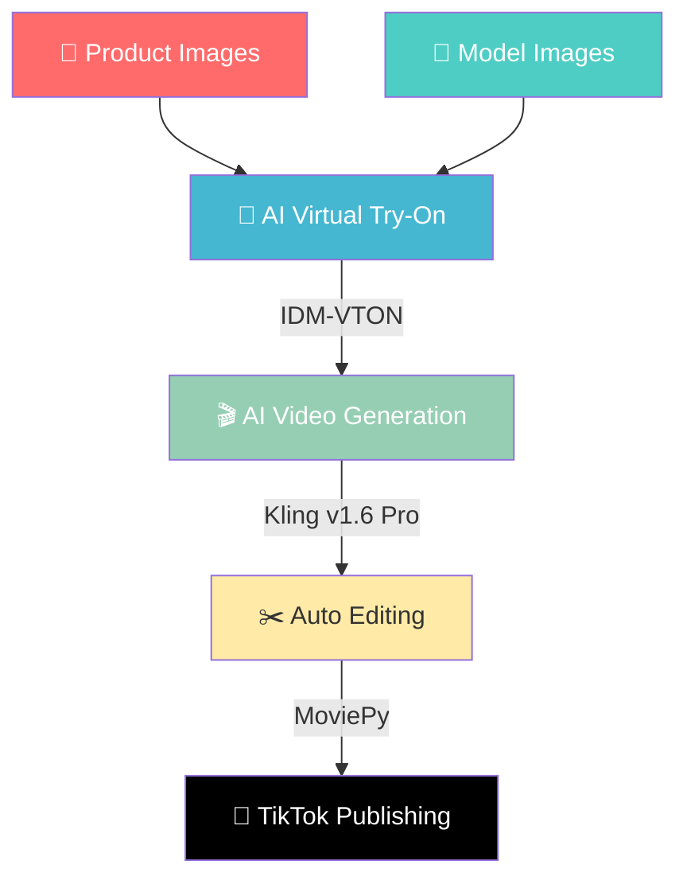

<div align="center">

# 👖 Jeans AI

### ✨ *Where AI Meets Fashion* ✨

[](https://python.org)
[](https://fastapi.tiangolo.com)
[](https://developers.tiktok.com)
[](https://postgresql.org)

**AI-powered e-commerce platform for women's jeans.**
**Automatically generates virtual try-on images, fashion videos, and publishes to TikTok.**

---

</div>

## 🎨 Architecture



## 💎 Tech Stack

| Layer | Technology | Badge |
|-------|-----------|-------|
| 🚀 **Backend** | FastAPI + Python 3.12 |  |
| 🗄️ **Database** | PostgreSQL + SQLAlchemy 2.0 |  |
| ⚡ **Queue** | Redis + APScheduler |  |
| 👗 **AI Try-On** | IDM-VTON on Replicate |  |
| 🎥 **AI Video** | Kling v1.6 Pro on Replicate |  |
| ✂️ **Editing** | MoviePy + FFmpeg |  |
| 📱 **Publishing** | TikTok Content Posting API |  |
| 📦 **Package** | uv (Rust-powered) |  |

## 🚀 Quick Start

### Prerequisites

> 💡 Make sure you have these installed before starting

- 🐍 Python 3.12+
- 🐳 Docker (for Redis)
- 🐘 PostgreSQL (running locally)
- 🔑 Replicate API token
- 📱 TikTok Developer App

### Setup

```bash
# 📥 Clone
git clone https://github.com/aifidelity9-lab/jeans-ai.git
cd jeans-ai

# 🏗️ Create virtual environment
uv venv --python 3.12

# 📦 Install dependencies
uv pip install -e ".[dev]"
uv pip install replicate moviepy apscheduler

# 🐳 Start Redis
docker compose up -d

# ⚙️ Configure environment
cp .env.example .env
# Edit .env with your API keys

# 🚀 Run server
python run.py
```

> 🌐 Server runs at **http://localhost:8001/docs**

## 🔌 API Endpoints

### 📦 Products
| Endpoint | Method | Description |
|----------|--------|-------------|
| `/api/products/` | `GET` | List all products |
| `/api/products/` | `POST` | Upload new product |

### 👗 Virtual Try-On
| Endpoint | Method | Description |
|----------|--------|-------------|
| `/api/tryon/single` | `POST` | Single try-on test |
| `/api/tryon/batch` | `POST` | Batch try-on across models |

### 🎬 Pipeline
| Endpoint | Method | Description |
|----------|--------|-------------|
| `/api/pipeline/run` | `POST` | Full pipeline: try-on → video → edit |
| `/api/pipeline/batch` | `POST` | One product × N models |
| `/api/pipeline/daily` | `POST` | 🔥 Trigger daily auto-generation |

### 📱 Publishing
| Endpoint | Method | Description |
|----------|--------|-------------|
| `/api/publish/tiktok/auth` | `GET` | TikTok OAuth |
| `/api/publish/tiktok/publish` | `POST` | Publish to TikTok |

## ⏰ Daily Auto-Generation

> 🤖 The system automatically runs at **6:00 AM EST** every day

```
1. 📸 Scans assets/products/ for garment images
2. 💃 Scans assets/models/ for model images
3. 🔄 Generates all product × model combinations
4. 🎬 Outputs final videos to output/YYYY-MM-DD/final/
```

### Manual trigger:

```bash
# 🌐 Via API
curl -X POST http://localhost:8001/api/pipeline/daily

# 💻 Via command line
python -m src.tasks.daily_pipeline
```

## 📁 Directory Structure

```
jeans-ai/
├── 🐍 src/
│   ├── main.py              # FastAPI app entry
│   ├── config.py            # Settings
│   ├── database.py          # DB connection
│   ├── models/              # SQLAlchemy models
│   ├── api/                 # API routes
│   │   ├── products.py      # Product CRUD
│   │   ├── tryon.py         # Try-on endpoints
│   │   ├── pipeline.py      # Pipeline endpoints
│   │   └── publish.py       # TikTok publishing
│   ├── tryon/
│   │   └── engine.py        # IDM-VTON integration
│   ├── video/
│   │   └── generator.py     # Kling video generation
│   ├── editor/
│   │   └── composer.py      # MoviePy video editing
│   ├── publisher/
│   │   └── tiktok.py        # TikTok API client
│   └── tasks/
│       ├── daily_pipeline.py # Daily batch pipeline
│       └── scheduler.py      # APScheduler config
├── 👖 assets/
│   ├── products/            # Jeans flat-lay images
│   ├── models/              # Full-body model images
│   └── music/               # Background music
├── 🎬 output/               # Generated content
├── 📄 docs/                 # GitHub Pages
├── 🐳 docker-compose.yml    # Redis
├── 📦 pyproject.toml        # Dependencies
├── 🚀 run.py                # Server entry point
└── 🔑 .env                  # API keys (not in git)
```

## 💰 Cost Estimate

<div align="center">

| Component | Per Unit | Daily (100 videos) | Monthly |
|:---------:|:--------:|:-------------------:|:-------:|
| 👗 Try-on (Replicate) | ~$0.023/image | $11.50 | $345 |
| 🎥 Video (Kling) | ~$0.10/video | $10.00 | $300 |
| **💵 Total** | | **$21.50** | **$645** |

</div>

---

<div align="center">

### Made with 🤖 AI + 💖 Fashion

**Rebecca** — *Denim, Reinvented.*

</div>
